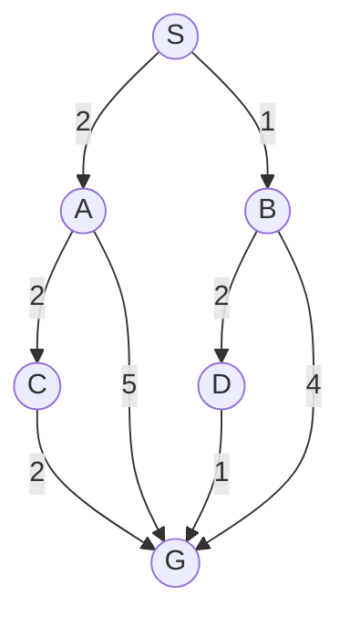

# Taller: búsqueda, optimización y Q-learning

**Modalidad:** trabajo individual, desarrollado a mano  
**Objetivo:** analizar una iteración de cada algoritmo y justificar las decisiones tomadas.

---

## 1. Algoritmos de búsqueda

Considere el siguiente problema. Los números sobre las conexiones representan su costo.

La expansión de sucesores se realiza de izquierda a derecha. El estado inicial es $S$ y el objetivo es $G$.

### Actividad

1. Después de expandir $S$, escriba el contenido de la frontera para:

   - BFS
   - DFS
   - UCS

   **Respuesta:** al expandir $S$ se generan sus sucesores en orden $A$ (costo 2) y luego $B$ (costo 1). Cada algoritmo organiza esos dos nodos de forma distinta según su estructura de datos:

   - **BFS** (cola FIFO): frontera = $[A, B]$ — $A$ entró primero.
   - **DFS** (pila LIFO): frontera = $[B, A]$ (de arriba hacia abajo) — $B$ quedó encima por haber entrado al final.
   - **UCS** (cola de prioridad por $g(n)$): frontera ordenada = $B(1), A(2)$ — el costo acumulado manda, no el orden de llegada.

2. Para cada algoritmo, indique cuál es el siguiente nodo que se expande.

   **Respuesta:**
   - **BFS:** $A$ (primero en entrar a la cola FIFO).
   - **DFS:** $B$ (último en entrar, queda arriba de la pila LIFO).
   - **UCS:** $B$ (tiene el menor $g(n)=1$).

3. Realice las expansiones necesarias hasta que **UCS seleccione el objetivo**. En cada iteración complete:

| Iteración | Nodo seleccionado | Costo acumulado $g(n)$ | Frontera después de expandir |
|---:|---|---:|---|
| 1 | B | 1 | A:2, D:3, G:5 |
| 2 | A | 2 | D:3, C:4, G:5 |
| 3 | D | 3 | C:4, G:4 |
| 4 | G | 4 | (se detiene: objetivo seleccionado) |

   Detalle de cada fila:
   - **Iter 1:** se expande $B$, generando $D$ ($1+2=3$) y $G$ ($1+4=5$).
   - **Iter 2:** se expande $A$ (siguiente menor costo), generando $C$ ($2+2=4$); el camino a $G$ por $A$ daría $2+5=7$, peor que el $G=5$ ya guardado, así que no se actualiza.
   - **Iter 3:** se expande $D$, y se encuentra $G$ con $3+1=4$, mejor que el $5$ anterior → se actualiza el costo de $G$.
   - **Iter 4:** $G$ ya es el nodo de menor costo en la frontera (4) → UCS lo selecciona y termina. Camino final: **S → B → D → G**, costo total **4**.

4. Responda:

   a. ¿Por qué UCS selecciona primero $B$, aunque $A$ y $B$ estén en la misma profundidad?

   **Respuesta:** UCS no mira la profundidad, solo el costo acumulado $g(n)$. Como $g(B)=1 < g(A)=2$, gana $B$ sin importar que ambos sean hijos directos de $S$.

   b. ¿Cuál camino encuentra UCS?

   **Respuesta:** $S \to B \to D \to G$, con costo total $4$ — el más barato entre todas las alternativas ($S$-$A$-$G$=7, $S$-$A$-$C$-$G$=6, $S$-$B$-$G$=5).

   c. ¿El primer camino que llega a $G$ necesariamente es el camino que UCS debe aceptar? Justifique.

   **Respuesta:** No. $G$ aparece por primera vez en la frontera desde la iteración 1 (vía $B$, con costo 5), pero UCS no lo acepta ahí: lo deja esperando en la frontera y sigue expandiendo lo más barato disponible. Solo "acepta" un nodo objetivo cuando lo **extrae** de la frontera, es decir, cuando ya está garantizado que es el de menor costo posible. Por eso el costo de $G$ se mejora de 5 a 4 antes de ser aceptado.

   d. Si todas las conexiones tuvieran costo $1$, ¿qué relación existiría entre BFS y UCS?

   **Respuesta:** Serían equivalentes. Con costos uniformes, $g(n)$ es proporcional a la profundidad, así que UCS expandiría los nodos en el mismo orden por niveles que BFS, y ambos encontrarían el mismo camino óptimo. BFS es un caso particular de UCS cuando todos los costos son iguales.

---

## 2. Optimización: simulated annealing

Se quiere minimizar una función de costo. El algoritmo se encuentra actualmente en un estado con:

$$
f(s_{\text{actual}})=8
$$

Se genera un vecino con:

$$
f(s_{\text{nuevo}})=11
$$

La temperatura actual es:

$$
T=4
$$

Para problemas de minimización se utiliza:

$$
\Delta=f(s_{\text{nuevo}})-f(s_{\text{actual}})
$$

Si el vecino es peor, se acepta con probabilidad:

$$
P(\text{aceptar})=e^{-\Delta/T}
$$

Suponga que el algoritmo genera el número aleatorio:

$$
r=0.35
$$

### Actividad

1. Calcule $\Delta$.

   **Respuesta:** $\Delta = f(s_{\text{nuevo}}) - f(s_{\text{actual}}) = 11 - 8 = 3$.

2. ¿El nuevo estado es mejor o peor que el actual? Explique usando el signo de $\Delta$.

   **Respuesta:** Es peor. Como se está minimizando, $\Delta>0$ significa que el costo aumentó (de 8 a 11). Si $\Delta$ fuera negativo o cero, el vecino sería igual o mejor y se aceptaría sin necesidad de calcular ninguna probabilidad.

3. Calcule aproximadamente la probabilidad de aceptar el nuevo estado.

   **Respuesta:** $P(\text{aceptar}) = e^{-\Delta/T} = e^{-3/4} = e^{-0.75} \approx 0.47$.

4. Compare la probabilidad calculada con $r$. ¿El algoritmo acepta el movimiento?

   **Respuesta:** Sí. La regla es aceptar si $r < P(\text{aceptar})$, y aquí $0.35 < 0.47$, así que el algoritmo acepta el peor estado aunque tenga costo más alto.

5. Sin realizar nuevamente todos los cálculos, explique qué ocurriría si:

   a. La temperatura fuera $T=0.5$.

   **Respuesta:** $\Delta/T = 3/0.5 = 6 \Rightarrow P=e^{-6}\approx 0.0025$. La probabilidad se desploma casi a cero: con temperatura baja es muy improbable aceptar un empeoramiento, el algoritmo se vuelve casi tan estricto como Hill Climbing.

   b. La temperatura fuera $T=20$.

   **Respuesta:** $\Delta/T = 3/20 = 0.15 \Rightarrow P=e^{-0.15}\approx 0.86$. La probabilidad sube mucho: con temperatura alta casi cualquier vecino se acepta, incluso si es bastante peor, dominando la exploración sobre la explotación.

6. Responda conceptualmente:

   a. ¿Por qué simulated annealing puede aceptar una solución peor?

   **Respuesta:** Para evitar quedarse atrapado prematuramente en un mínimo local: aceptar ocasionalmente un paso "cuesta arriba" le permite seguir explorando el espacio de búsqueda en busca de un mínimo mejor, o el global.

   b. ¿Qué ventaja tiene esta decisión frente a hill climbing?

   **Respuesta:** Hill Climbing solo acepta mejoras estrictas, así que en cuanto llega a un mínimo local se detiene ahí para siempre, aunque exista una solución mejor en otra parte del espacio. Simulated Annealing puede escapar de esa trampa gracias a los movimientos aceptados con probabilidad.

   c. ¿Qué debería ocurrir con la exploración cuando la temperatura se aproxima a cero?

   **Respuesta:** Debería reducirse casi hasta desaparecer. Con $T$ muy pequeña, $e^{-\Delta/T}\to 0$ para cualquier $\Delta>0$, así que el algoritmo deja de aceptar empeoramientos y pasa a comportarse como una búsqueda de pura explotación (como Hill Climbing) — la fase final donde se espera estar cerca de una buena solución y solo pulirla.

   d. Si el vecino tuviera costo $5$, ¿sería necesario calcular una probabilidad para aceptarlo?

   **Respuesta:** No. $\Delta = 5-8=-3 \le 0$, es decir, el vecino es mejor. La regla de aceptación devuelve probabilidad 1 directamente en ese caso; no hace falta ningún cálculo exponencial, la mejora se acepta siempre.

---

## 3. Q-learning

Un agente se encuentra en el estado $S$ y puede realizar tres acciones:

| Acción | Resultado inmediato | Recompensa | $Q(S,a)$ actual |
|---|---|---:|---:|
| Avanzar | Llega a $S'$ | $+1$ | $2.0$ |
| Esperar | Permanece en $S$ | $-1$ | $0.5$ |
| Saltar | Cae y muere | $-10$ | $-2.0$ |

En el siguiente estado $S'$, el mayor valor disponible es:

$$
\max_{a'}Q(S',a')=4
$$

Use:

$$
\alpha=0.5, \qquad \gamma=0.9
$$

La regla de actualización es:

$$
Q(S,a) \leftarrow Q(S,a)+
\alpha\left[
r+\gamma\max_{a'}Q(S',a')-Q(S,a)
\right]
$$

### Actividad

Suponga que el agente selecciona **Avanzar**.

1. Identifique:

   - $Q(S,\text{Avanzar})$
   - $r$
   - $\max_{a'}Q(S',a')$

   **Respuesta:** $Q(S,\text{Avanzar})=2.0$, $r=+1$, $\max_{a'}Q(S',a')=4$.

2. Calcule el objetivo temporal:

$$
r+\gamma\max_{a'}Q(S',a')
$$

   **Respuesta:** $1 + 0.9(4) = 1 + 3.6 = 4.6$.

3. Calcule el error temporal:

$$
\delta = r+\gamma\max_{a'}Q(S',a')-Q(S,\text{Avanzar})
$$

   **Respuesta:** $\delta = 4.6 - 2.0 = 2.6$.

4. Realice una actualización de $Q(S,\text{Avanzar})$.

   **Respuesta:** $Q(S,\text{Avanzar}) \leftarrow 2.0 + 0.5(2.6) = 2.0 + 1.3 = 3.3$.

5. ¿El valor de la acción aumentó o disminuyó? Explique por qué.

   **Respuesta:** Aumentó, de 2.0 a 3.3. El objetivo temporal (4.6) resultó mayor que la estimación previa (2.0), es decir, la experiencia real (recompensa + valor futuro estimado) fue mejor de lo que la tabla $Q$ predecía, así que $Q$ se corrige hacia arriba, en dirección al objetivo.

### Preguntas de análisis

6. Si el agente aprende correctamente, ¿cómo debería ser el valor de **Saltar** en comparación con los valores de las otras acciones?

   **Respuesta:** Debería ser el más bajo de los tres, y muy negativo — cercano a la recompensa de morir ($-10$), muy por debajo de Avanzar y Esperar.

7. Si morir termina inmediatamente el episodio, ¿se debe considerar el valor de un estado futuro en la actualización de **Saltar**? Explique.

   **Respuesta:** No. Cuando el episodio termina (`done=True`) no existe un estado siguiente desde el cual seguir actuando, así que el objetivo temporal es solo $r$, sin el término $\gamma\max_{a'}Q(S',a')$. Por eso Saltar converge exactamente a $-10$, sin ningún descuento adicional.

8. ¿Por qué el valor actual de $Q(S,\text{Saltar})=-2$ todavía podría ser demasiado alto?

   **Respuesta:** Porque es un valor solo parcialmente aprendido: el agente ya sabe que Saltar es malo, pero aún no ha actualizado lo suficiente para que $Q$ se acerque al verdadero castigo, que es $r=-10$ (sin descuento, por la razón de la pregunta 7). Cada vez que se repita esa acción, $\delta$ seguirá siendo muy negativo y seguirá empujando el valor hacia abajo. Mientras $Q(S,\text{Saltar}) > -10$, todavía está subestimando el peligro real.

9. Según la tabla actual, ¿qué acción seleccionaría una política completamente voraz?

   **Respuesta:** Avanzar, porque tiene el mayor $Q$ (2.0, y 3.3 tras la actualización), muy por encima de Esperar (0.5) y Saltar (-2.0).

10. ¿Significa lo anterior que el agente nunca puede seleccionar otra acción durante el entrenamiento? Explique considerando una política $\varepsilon$-greedy.

    **Respuesta:** No. Eso solo describe la política greedy pura. Durante el entrenamiento se usa $\varepsilon$-greedy: con probabilidad $\varepsilon$ el agente elige una acción al azar —incluida Esperar o incluso Saltar—, aunque no sea la de mayor $Q$, para seguir explorando y confirmar (o corregir) qué tan buenas o malas son realmente las otras acciones. Solo al evaluar la política final con $\varepsilon=0$ el agente se vuelve estrictamente voraz.

11. Suponga que **Avanzar** entrega recompensa inmediata $0$, pero conduce a estados con recompensas altas en el futuro. ¿Puede llegar a tener un valor $Q$ alto? Justifique.

    **Respuesta:** Sí. La regla de actualización no depende solo de $r$, sino también de $\gamma\max_{a'}Q(S',a')$: el valor de las recompensas futuras se propaga hacia atrás mediante actualizaciones repetidas (bootstrapping). Si $S'$ tiene un buen valor futuro, ese valor termina reflejándose en $Q(S,\text{Avanzar})$ aunque la recompensa inmediata haya sido cero.

12. ¿Qué controla cada parámetro?

| Parámetro | ¿Qué controla? | ¿Qué podría ocurrir si es muy alto? |
|---|---|---|
| $\alpha$ | Qué tan grande es el "salto" que da $Q$ hacia el nuevo objetivo en cada actualización (tasa de aprendizaje). | El agente sobrerreacciona a cada experiencia individual; $Q$ oscila mucho y puede no converger nunca (aprendizaje inestable). |
| $\gamma$ | Cuánto le importan al agente las recompensas futuras frente a las inmediatas. | El agente casi iguala recompensas lejanas con inmediatas; los errores se propagan por cadenas largas de estados, haciendo el entrenamiento más lento y sensible al ruido. |
| $\varepsilon$ | La probabilidad de explorar (acción aleatoria) en vez de explotar lo ya aprendido. | El agente actúa casi al azar todo el tiempo, ignorando lo que ya sabe; el entrenamiento es muy ineficiente y las recompensas se mantienen bajas incluso avanzado el entrenamiento. |
